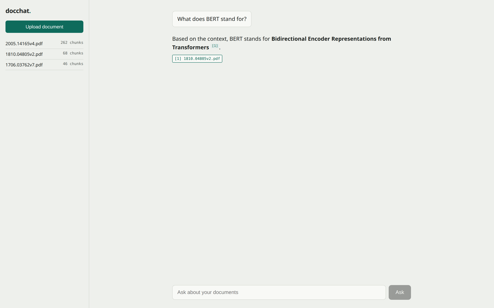
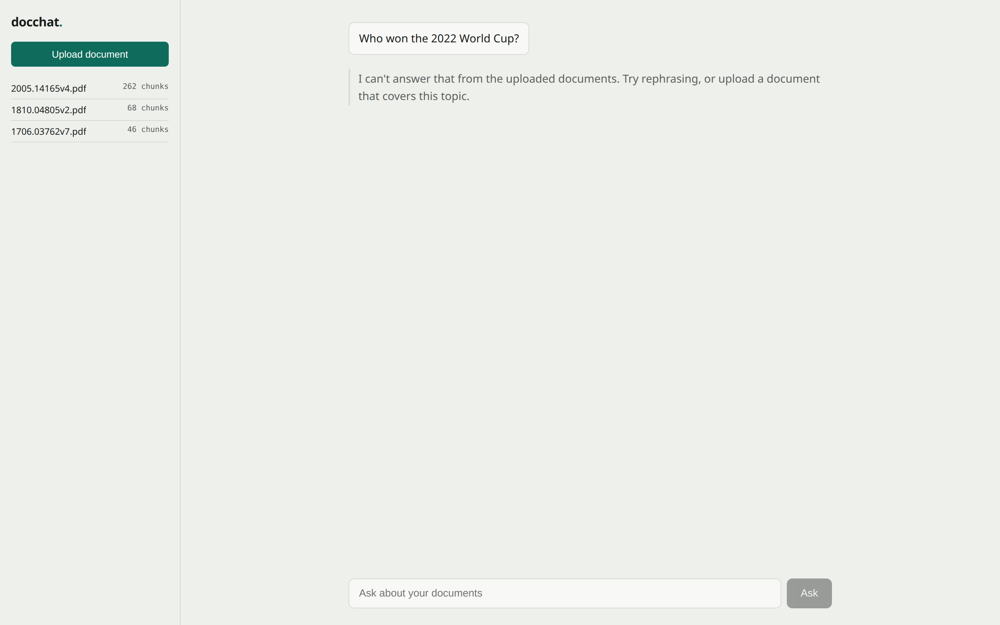

# docchat — Chat With Your Docs

[](https://github.com/elaz48/grounded-docchat/actions/workflows/ci.yml)


Upload documents, ask questions, get grounded answers with citations.
Built for the Newpage AI-Native Builder assignment (Option 1).


## Quick setup

```bash
cp .env.example .env        # add ANTHROPIC_API_KEY and OPENAI_API_KEY
docker compose up --build   # Postgres (pgvector) + API on :8000
cd frontend && npm install && npm run dev   # UI on :5173
```

Run the tests (no API keys, no DB, no network needed):

```bash
pip install -r requirements-dev.txt
pytest
```

## Architecture overview

```
frontend (React/Vite)
   │  POST /api/documents, POST /api/ask
   ▼
FastAPI ── RagService ──┬── Embedder port ──► OpenAI text-embedding-3-small
   │                    ├── VectorStore port ► Postgres + pgvector (hybrid RRF)
   │                    └── AnswerModel port ► Claude (grounded, cited)
   ▼
tests: the same ports — placeborag fakes for Embedder + VectorStore,
       a hand-rolled stub for AnswerModel (offline CI)
```

The RagService does not know that OpenAI, pgvector or Claude exist. The ports make it possible to test with deterministic fakes plugged into the same interfaces. Two of the three are placeborag fakes: the embedder and the vector store, where the thing worth simulating is embedding geometry and rank order. The AnswerModel doubles are hand-rolled, a handful of lines each, because what the tests need from a model is an echo and an exception. Provider changes are a given in AI systems, so the ports turn them into an explicit, testable code path. The scoring convention is app-wide: a higher score is a better match, and the adapter converts whenever a backend reports the opposite (distance-based stores like Chroma vs similarity-based ones like Qdrant). This is an extra abstraction layer in a small app, which I would normally avoid. Here the interfaces sit exactly at the external boundaries, so the cost buys isolation of the three most volatile dependencies: the embedding API, the vector store, and the LLM.


## Productionization (AWS / GCP / Azure / Cloudflare)

- **Managed Postgres + pgvector (Neon / AWS RDS):** move the dev database to a managed service for proper memory management of the HNSW indexes and automated backups.
- **Stateless Python API in containers (AWS ECS / GCP Cloud Run):** the API layer holds no state, so it scales horizontally with load.
- **Object storage (S3 / GCS) + async ingestion queue:** originals stored durably, large corpora processed in the background (e.g. Celery/Redis) instead of risking synchronous HTTP timeouts.
- **Secrets manager + auth layer:** API keys and database credentials move to a cloud secret store; JWT-based authentication in front of the API endpoints.
- **Centralised structured logging and metrics:** ship the JSON logs somewhere queryable (Datadog / Grafana Loki) for request-ID tracing, extended with token-usage and latency metrics.
- **Cloudflare Workers vs. backend container:** Workers fit edge routing and serving the frontend, but the strict V8 runtime limits (memory, execution time, missing native Python dependencies) mean the RAG backend and the Postgres query layer stay containerised.

## RAG / LLM approach & decisions

The full decision log with alternatives considered lives in
[docs/PLAN.md](docs/PLAN.md). Summary:

| Decision | Choice | Why (short) |
|---|---|---|
| LLM | Claude Sonnet | Good price/quality ratio, and it follows the "answer only from context" instruction and the citation format reliably. |
| Embeddings | OpenAI text-embedding-3-small | Cheap and ubiquitous, easily good enough for this task, and swapping it later is a tested code path, so it's a low-risk choice. |
| Vector store | Postgres + pgvector | One database serves the relational data, the vector search and the keyword search, so I operate one system instead of three, and Postgres is where I'm deepest. |
| Retrieval | Hybrid: HNSW cosine + tsvector keyword, RRF fusion | Vector search can miss exact terms like "BERT", keyword search misses paraphrases; RRF fuses ranks instead of raw scores, so the two signals need no normalisation, and the metadata filter runs before the top-k cut in both arms. |
| Chunking | Paragraph packing, ~1200 chars, 150 overlap | Paragraphs are natural semantic units; the overlap protects answers that span a chunk boundary, and the behaviour is simple enough to test. Semantic chunking stays in the backlog until evals justify it. |
| Orchestration | None (plain Python service) | Three linear steps, no branching or state; my port layer is a few dozen lines I control, a framework would add surface, not value. |
| Guardrails | Context-only system prompt + NOT_IN_CONTEXT refusal + score floor | Two layers that actually fire: the system prompt constrains the content, and NOT_IN_CONTEXT turns the model's own "I don't know" into an honest refusal. The rank-based score floor turned out to be a no-op by construction — the evals proved it — so the finding is documented in the decision log, and the real retrieval-side layer (a cosine-distance threshold) sits in the backlog. |
| Quality | Offline retrieval contract tests + golden-set evals (evals/) | Two levels for two different questions: offline contract tests prove the retrieval pipeline behaves correctly (deterministic, no API keys), golden-set evals measure retrieval + grounding on real documents — citation presence and refusal correctness. Neither judges answer quality; LLM-graded prose is in the backlog. |
| Observability | Structured JSON logs, request-scoped IDs, latency per request | The request ID is bound into the logging context, not just into the middleware's own logger, so every line a request emits carries it. Enough to debug a system this size; anything heavier belongs to productionization. |

### The eval corpus

The golden set is built on three public arXiv PDFs, so anyone can reproduce the run: *Attention Is All You Need* ([1706.03762](https://arxiv.org/abs/1706.03762)), *BERT* ([1810.04805](https://arxiv.org/abs/1810.04805)) and *Language Models are Few-Shot Learners* / GPT-3 ([2005.14165](https://arxiv.org/abs/2005.14165)). Upload those three, then run `python evals/run_evals.py`; `evals/golden.jsonl` names them as the expected citations. Twelve answerable questions (four per paper, mixing verbatim lookups with paraphrased ones that the keyword arm cannot match on wording) and three unanswerable ones that must be refused.

### What the evals found

The first eval run scored 13/15. A close look at the scores revealed that not a single chunk had come from both retrieval arms at once: every score was a pure 1/(60+rank) value, never a two-term sum. The diagnosis: Postgres `plainto_tsquery` ANDs all lexemes, so on question-shaped input 11 out of 12 questions produced zero keyword hits — the "hybrid" retrieval was silently vector-only.

After rewriting the keyword arm to OR semantics (and pinning the two failing cases as regression tests, written RED before the fix), the run scores 14/15. The remaining failure is a documented recall limit: the answering chunk sits at vec_rank=120, out of reach of the retrieval pool — a job for a reranker, not for Boolean semantics. As a side finding, the evals also proved that the rank-based score floor is a no-op by construction, which is now handled openly in the decision log rather than left as theory.

## Key technical decisions

1. **Retrieval tested with deterministic test doubles (placeborag, my own OSS library):** with random mock vectors, a rank-order assertion is decorative — anything can come back in any order. Deterministic fakes plugged into the same ports make rank order a real, offline assertion. The suite also carries an executable control case: the same data under post-filter mode returns nothing, so the under-return bug my pre-filtering SQL avoids is demonstrated in a runnable test, not just described.
2. **Hybrid retrieval inside Postgres:** vector similarity and full-text search fused in one database, zero extra services. The decision earned its keep after the eval finding: fixing the `plainto_tsquery` semantics is what made the keyword arm actually contribute, and the fix was a query change, not a new component.
3. **Degrade, don't collapse — and owning the floor finding:** failure modes are product decisions. A failing retrieval path returns an honest "try again" instead of a 500; so does a failing generation call, since rate limits and overload are the LLM's ordinary failure modes and the two get distinct messages because they are distinct events; an unanswerable question gets a refusal instead of a hallucination. All three behaviours are pinned by tests. The same honesty applies to the score floor the evals falsified: instead of keeping a layer that looks protective and does nothing, the no-op is documented and the real second layer (a cosine-distance threshold) sits in the backlog.

## Engineering standards followed (and skipped)

**Followed:**

- **Ports and adapters at the external boundaries:** the core logic is independent of third-party APIs and the database implementation.
- **Test-first for logic:** every regression test here was written and watched fail before the fix existed. Being precise about what the history proves: the failing test and the fix landed in the same commit, so the RED state is something I observed, not something you can verify from `git log`. With more time I'd commit the failing test on its own first, so the sequence is in the history instead of in this paragraph.
- **Offline-first test suite:** the full suite runs without API keys, avoiding key leakage and network flakiness in CI.
- **CI on every push (GitHub Actions):** lint and tests gate every change.
- **Pinned dependencies:** `requirements.txt` is the frozen working set of the image the demo ran on, so the container and CI resolve the same versions tomorrow as today.
- **Structured JSON logging with request-scoped IDs:** the request ID is bound into structlog's context (`merge_contextvars`), so every line a request produces carries it — including the ones logged deep in ingest or retrieval, which are the lines you actually need when tracing a failure, not just the request summary the middleware writes.
- **Containerised dev environment:** one reproducible runtime via Docker.
- **Typed, frozen dataclasses at the boundaries:** prevents unexpected mutation and type drift.
- **Parameterised SQL, verified with hostile-input tests:** no caller-supplied string is ever interpolated into query text, and targeted attack-shaped inputs assert it.
- **Human-review rule for SQL and prompts:** generated queries and prompts never enter the codebase unreviewed.

**Skipped, deliberately:**

- **Authentication/authorisation:** not justified for a single-user demo; in production I'd put an OAuth2/JWT layer in front.
- **Rate limiting:** nothing throttles uploads or questions, and both spend money per call; in production I'd limit per identity at the gateway and cap upload size and question length at the API boundary (both in the backlog).
- **Database migration tooling:** the schema was static; in production, Alembic.
- **Streaming responses:** the focus was retrieval quality; in production I'd add SSE.
- **Multi-tenant isolation:** this is a proof of concept at single-user scale; in production, schema-level or row-level (RLS) isolation.
- **Conversation memory:** single-question RAG by design; in production I'd add sliding-window or summary memory.

## How I used AI tools

I used AI coding tools as a tightly directed executor, not as a code-generating magic wand.

- **CLAUDE.md as a standing ruleset:** the conventions and architectural constraints are committed to the repo, so they didn't need restating in every prompt — every session worked against the same rules, including the ones about what the AI may not decide alone.
- **Plan-first, state in the repo:** `docs/PLAN.md` is the decision log and milestone tracker. Sessions were restarted deliberately; a fresh session picked up the exact state from PLAN.md and the git history, not from conversation memory.
- **Human-review rule:** generated SQL and prompts never entered the codebase unread. This mattered twice in this project: the review caught that `websearch_to_tsquery` still ANDs bare terms, so it alone would not have revived the keyword arm, and I did not let the coupling between `RETRIEVAL_K` and the grounding floor stay as hidden, undocumented logic.
- **Test-first, and no credit for tests I didn't watch fail:** regression tests were written and run failing before the fix, and the control tests stayed in the suite afterwards, so the diagnosis and the cause-effect chain live in the code, not in a commit message. They landed together with the fix, though — see the note in the standards list.
- **The eval arc:** the eval run surfaced a logic-level finding (a silently vector-only "hybrid" and a no-op guardrail layer) that neither manual code reading nor the unit tests could have shown.

Two things I never hand over: architectural decisions and the critical review of generated code and logic. What I delegate without worry: boilerplate, test scaffolding, and syntactic transformations.

## What I'd do differently with more time

- **Cross-encoder reranker (Cohere Rerank / BGE):** the remaining eval failure is a recall problem — the answering chunk sits at vec_rank=120 — and that's a reranker's job, not Boolean semantics.
- **Cosine-distance threshold as the real retrieval-side guardrail:** the floor finding showed that rank-based filtering cannot measure relevance; a similarity threshold can.
- **Corpus-diversity in retrieval (MMR):** one paper holds 70% of the chunks, and generic phrasings gravitate toward it, crowding neighbouring chunks of the same document into the top-k.
- **Page-level citations:** document-level references leave the reader too much surface to verify an answer against; page metadata from the PDFs would narrow it.
- **Streaming responses (SSE):** waiting for the full answer is the roughest edge of the current UX.

## Screenshots

![An answer to "What is multi-head attention?", with rendered formulas, inline [1] markers and a citation chip resolving to 1706.03762v7.pdf](docs/screenshots/answer-with-citations.png)





Screenshots are generated by `scripts/screenshots.mjs` (`npm run screenshots` from `frontend/`), which asks real questions against the live API and waits on rendered elements instead of fixed sleeps — so a timeout signals an actual application failure, not rendering lag.
